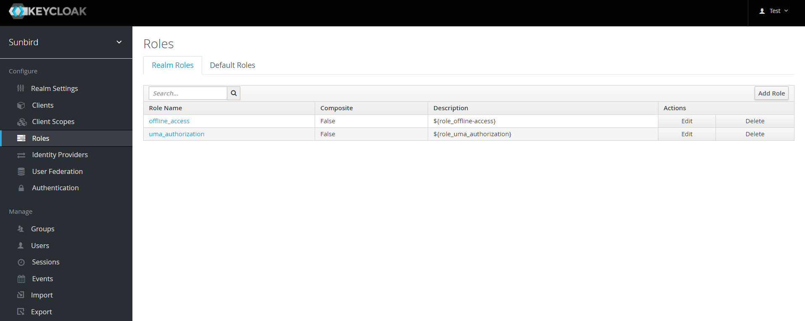
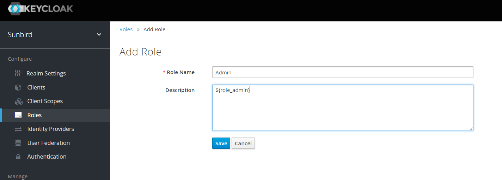
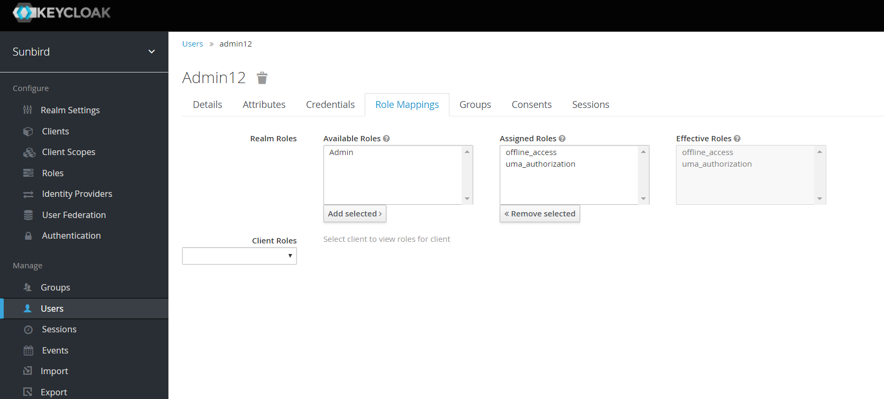
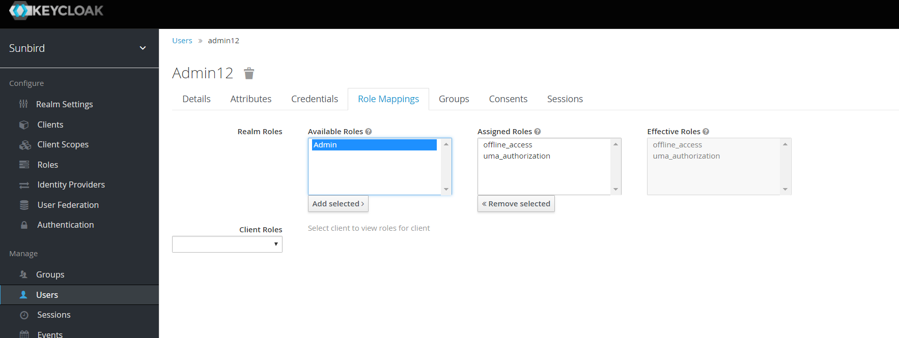
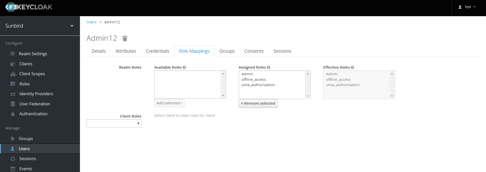
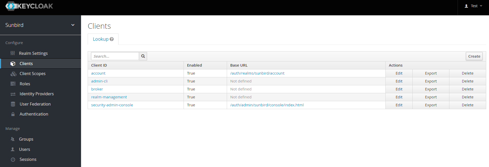
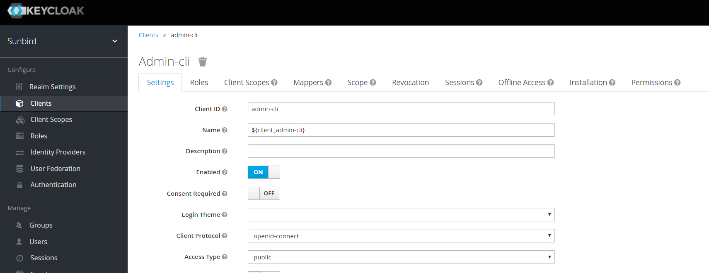
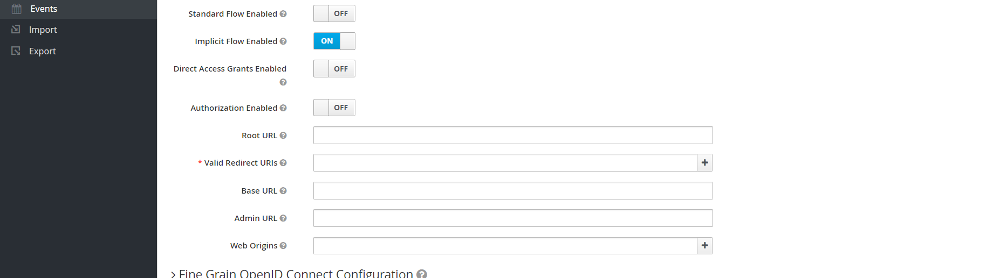

## Overview
A new user can be created in Sunbird in the following two ways:
- Self sign-up using Sunbird where user can provide email, phone and password during user creation
- Bulk users creation by Organisation Admin where an initial password is not yet set

The Sunbird requires users to either verify email (when user is created by self sign-up) or set password (when users are created by bulk upload) for the first time before they are able to log in to Sunbird.

The verify email or set password link is sent to the newly created users via email and/or SMS. The generated link also consists of a redirect URI to which the user is redirected after completing the required action.

This document explains the configuration required in Keycloak to generate links for the required action to be performed by a new user.

## Configure Environment Variables

Following environment variables need to be configured in Sunbird LMS service for generating required action links:

- sunbird_sso_url
- sunbird_sso_username
- sunbird_sso_password
- sunbird_sso_realm
- sunbird_sso_client_id
- sunbird_url_shortner_enable
- sunbird_url_shortner_access_token
- sunbird_keycloak_required_action_link_expiration_seconds

> Note: For details on the environment variables, refer to [Sunbird LMS Service Environment Variables](http://docs.sunbird.org/latest/developer-docs/configuring_sunbird/env_variables_lms/).

## Configure Administrator Role 

It is mandatory to configure a user with administrator role permissions to be able to generate the required action link in Keycloak.

<table>
<tr>
<th style="width:35%;">Step</th>
<th style="width:65%;">Screen</th>
 </tr>
  
<tr>
  <td>
1. Enter your <b>Username or email</b> and <b>Password</b>  2. Click <b>Log in</b> to log into the Keycloak admin console</td>
  <td></td>
</td>
<td></td>
</tr>
 
<tr>
  <td> 
2. Click the <b>Realm Selector dropdown</b> from the navigation pane and select the appropriate realm. 
<b>Note:</b> The <b>Master</b> realm is selected by default.
    </td>
    <td></td>
    </tr>
    
  <tr>
  <td> 
3. Go to the <b>Configure</b> section and select the <b>Roles</b> tab.
  </td>
  <td></td>
  </tr>
  
  <tr>
  <td> 
4. Go to the <b>Realms Roles</b> tab, click the <b>Add Role</b> button if the administrator role is not available in the Realm Roles table. If the role is available, then proceed to step 5. 
</td>
<td>
  
  </td>
  </tr>
 <tr>
  <td>
5. Go to the <b>Users</b> tab under the <b>Manage</b> section and search the user in the <b>Lookup</b> tab.
  </td>
  <td></td>
  </tr>
<tr>
<td> 
6. Click the <b>Role Mappings</b> tab.
  </td>
  <td></td>
  </tr>
  <tr>
<td> 
7. Assign the admin role at realm level.
  </td>
  <td></td>
  </tr>  
  <tr>
<td> 
8. Select the client option from the <b>Client Roles</b> drop-down list to which the user belongs and assign admin role at the client level.
  </td>
  <td></td>
  </tr>
</table>

## Configure Redirect URI 

The redirect URI configuration is necessary to redirect user to Sunbird tenant's specific home page after completing the required action steps.
<table>
<tr>
<th style="width:35%;">Step</th>
<th style="width:65%;">Screen</th>
 </tr>
  
<tr>
  <td>
1. Go to the <b>Configure</b> section and select the <b>Clients</b> tab in the navigation pane.
</td>
<td></td>
</tr> 
<tr>
  <td> 
2. Click the <b>client</b> corresponding to the user configured in step 8 of above section. 
    </td>
    <td></td>
    </tr>
    
  <tr>
  <td> 
3. Select the <b>Settings</b> tab and click the <b>Implicit Flow Enabled </b> toggle button. Once this button is enabled, a Valid Redirect URIs text box is displayed.
  </td>
  <td></td>
  </tr>
  
  <tr>
  <td> 
4. Enter values in the Root URL and Valid Redirect URIs text boxes.
</td>
<td>
  
  </td>
  </tr>
 
</table>
